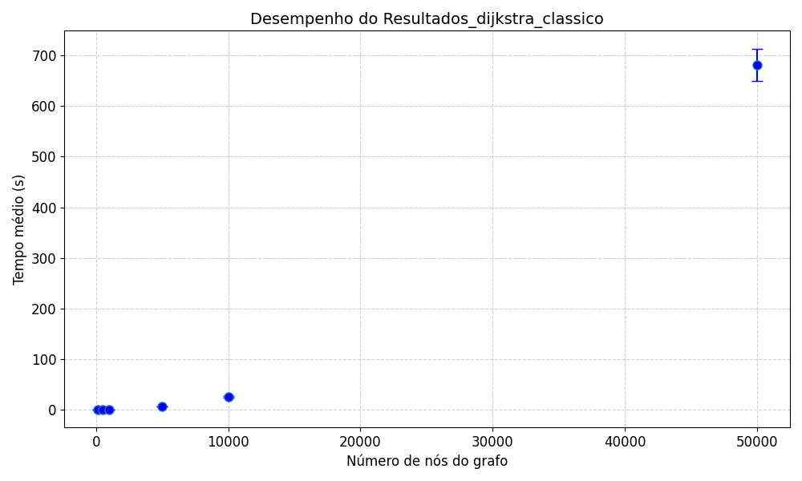
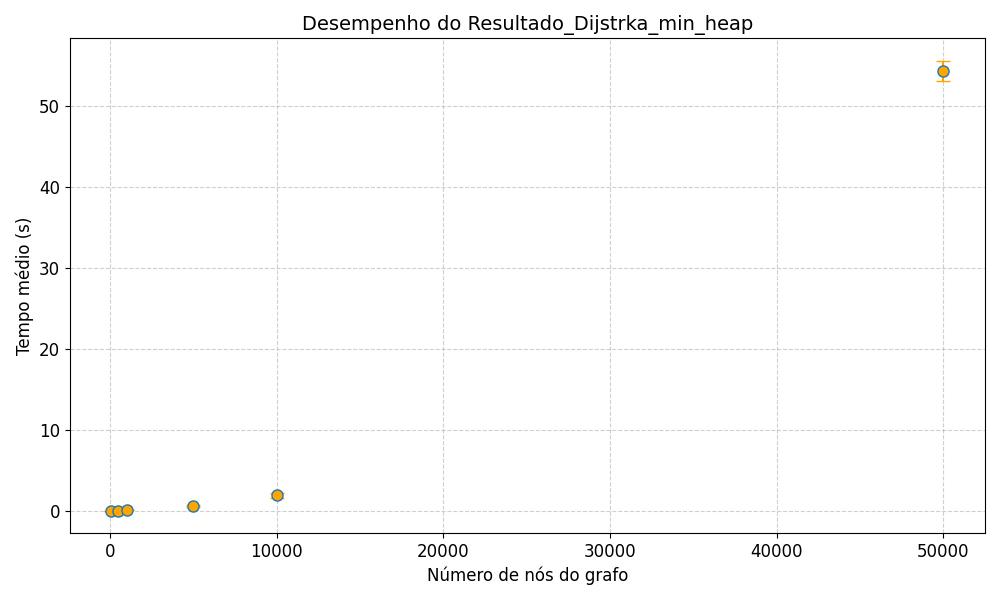
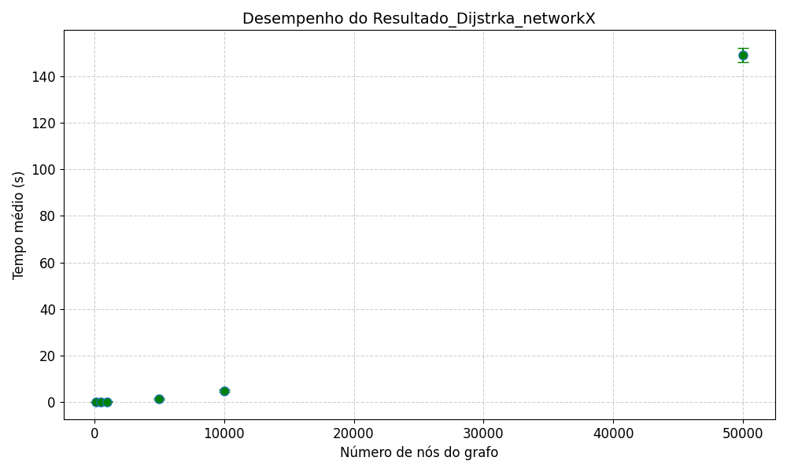
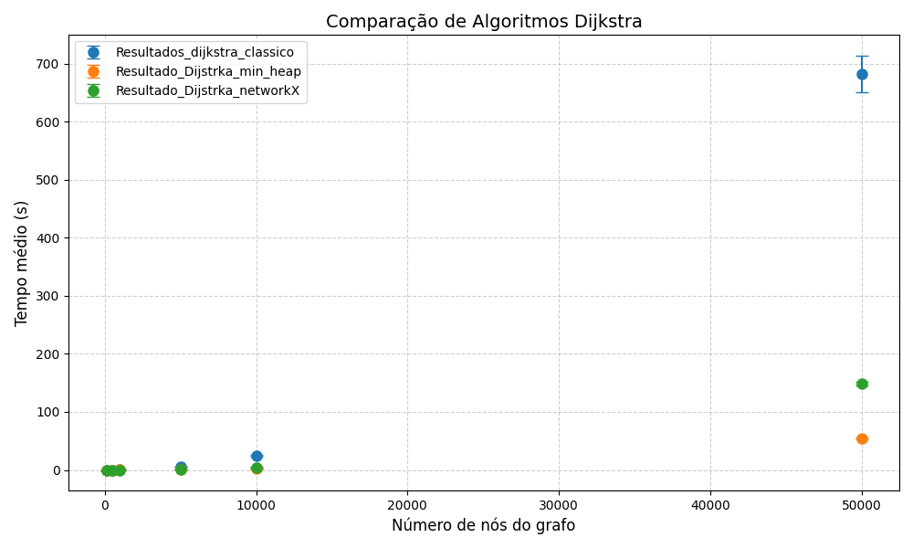

# Comparação de Performance: Algoritmos de Dijkstra

## Objetivos do Projeto

👤 **Autor:**  
Nome: Carlos Eduardo Medeiros da Silva  
Matrícula: 20250070673


Este projeto tem como objetivo comparar a performance de três versões do algoritmo de Dijkstra em grafos aleatórios:

1. **Dijkstra clássico** (O(V²) + E)  
2. **Dijkstra com Min-Heap** (O(V + E) * log V)
3. **Função de referência do NetworkX** 

A análise inclui tempo de execução, para diferentes tamanhos de grafos, possibilitando uma avaliação prática da eficiência dos algoritmos.

---

## Configuração Experimental

### Tamanhos dos Grafos Testados

| Número de Nós | Observações |
|---------------|-------------|
| 100           | Testado |
| 500           | Testado |
| 1_000         | Testado |
| 5_000         | Testado |
| 10_000        | Testado |
| 50_000        | Testado |
| 100_000       | Não testado por limitações de hardware |

### Geração dos Grafos

- Grafos aleatórios do tipo `nx.gnp_random_graph(n, p=0.01)`
- Pesos inteiros aleatórios entre 1 e 10
- 5 nós aleatórios por grafo
- 15 repetições por configuração]
- Sementes fixas para reprodutibilidade

### Métricas Coletadas

| Métrica                | Ferramenta |
|------------------------|------------|
| Tempo de execução (s)   | Python `time` |

---

## 📂 Estrutura do Projeto

```bash
unity2/
│
├─ notebooks/ # Notebooks com implementações e análises
├─ tabelas/ # Tabelas com os resultados (CSV)
├─ graficos/ # Gráficos de performance e CO₂
└─ README.md

```

## 📊 Métricas e Estatística

Nesta etapa, você vai transformar os dados brutos coletados (tempos e emissões de CO₂ de cada execução) em informações estatisticamente interpretáveis.  
O objetivo é comparar o desempenho dos algoritmos a partir das médias e desvios-padrão das execuções.

Para cada par (**tamanho do grafo**, **algoritmo**), calcule:

| Métrica        | Símbolo       | Descrição |
|----------------|---------------|-----------|
| Média          | $\bar{x}$   | Tempo médio das execuções |
| Desvio-padrão  | $s$         | Mede a variação dos resultados em torno da média |

Para cada algoritmo e tamanho de grafo, plote:

- **Eixo X:** número de nós do grafo  
- **Eixo Y:** tempo médio  
- Uma linha para cada algoritmo  
- Barras verticais indicando a variação (\(s\))  

## 🧠 Metodologia

O projeto foi desenvolvido para comparar o desempenho do **algoritmo de Dijkstra clássico** e do **Dijkstra com Min-Heap** e a **Implementação da biblioteca NetworkX** em grafos de diferentes tamanhos.  
Para isso, foi criada uma metodologia focada em **eficiência de memória**, **reprodutibilidade dos experimentos** e **organização das execuções**.

---

### 🔹 1. Geração dos Grafos (`criar_grafo`)

A função `criar_grafo(len_graph, p=0.01)` é responsável por **gerar e salvar grafos aleatórios ponderados e não direcionados** utilizando a biblioteca **NetworkX**.

- O grafo é criado com **probabilidade de conexão `p`**, que define a densidade das arestas.  
- Caso o grafo gerado **não seja conexo**, apenas o **maior componente conectado** é mantido para garantir que todos os vértices sejam alcançáveis.  
- Cada aresta recebe um **peso inteiro aleatório** entre 1 e 10.  
- Após criado, o grafo é **salvo em disco** (diretório `grafos/`) no formato `.gpickle`.  
- Em seguida, o grafo é **removido da memória** com `gc.collect()` para evitar consumo excessivo de RAM durante os experimentos com grafos grandes.

```python
def criar_grafo(len_graph, p=0.01):
    G = nx.gnp_random_graph(len_graph, p=p, seed=22)
    if not nx.is_connected(G):
        largest_cc = max(nx.connected_components(G), key=len)
        G = G.subgraph(largest_cc).copy()

    for u, v in G.edges():
        G[u][v]['weight'] = random.randint(1, 10)

    os.makedirs("grafos", exist_ok=True)
    with open(f"grafos/grafo_{len_graph}.gpickle", "wb") as f:
        pickle.dump(G, f)

    del G
    gc.collect()
```
📦 Resultado: cada grafo (grafo_100.gpickle, grafo_500.gpickle, etc.) é salvo em disco e pode ser recarregado individualmente, evitando sobrecarga na memória RAM.

### 🔹 2. Leitura dos Grafos (`ler_grafo`)

A função `ler_grafo(len_graph)` é usada para **carregar um grafo previamente salvo no disco**.  
Isso garante que o grafo possa ser **reutilizado em diferentes execuções**, sem precisar ser recriado.

```python
def ler_grafo(len_graph):
    with open(f"grafos/grafo_{len_graph}.gpickle", "rb") as f:
        G = pickle.load(f)
    print(f"🔄 Grafo 'grafo_{len_graph}' lido com sucesso ({G.number_of_nodes()} nós, {G.number_of_edges()} arestas)")
    return G
```

### 🔹 3. Estrutura de Dados (`parse_to_list`)

O código também inclui a função `parse_to_list`, utilizada apenas para **manter a estrutura de dados implementado nos arquivos dijsktra_min_heap.ipnyb e dijsktra.ipnyb**, garantindo compatibilidade entre as diferentes versões dos algoritmos testados.

Ela converte o grafo em uma **lista de adjacência**, uma estrutura mais leve e eficiente para a execução do **Dijkstra com Min-Heap**.

```python
def parse_to_list(edges):
    n = max(max(u, v) for u, v, _ in edges) + 1
    edges_estruturado = [[] for _ in range(n)]
    for u, v, data in edges:
        w = data['weight']
        edges_estruturado[u].append([v, w])
        edges_estruturado[v].append([u, w])
    return edges_estruturado
```

### 🔹 4. Seleção dos Nós Iniciais

Para realizar os experimentos, foram selecionados **5 nós iniciais aleatórios** para cada tamanho de grafo.  
O processo foi automatizado para garantir **reprodutibilidade** e **variedade** nas execuções.

- São definidos os tamanhos dos grafos: `100, 500, 1000, 5000, 10000 e 50000`.  
- Para cada tamanho, o grafo é **carregado do disco**.  
- São sorteados **5 nós diferentes**, repetindo o processo **15 vezes** (número de repetições definido).  
- Os resultados são armazenados em um **DataFrame** e salvos no arquivo `Starts_for_graph.csv` para uso posterior.

```python
tamanhos = [100, 500, 1000, 5000, 10000, 50000]
n_start = 5
n_repeticoes = 15
starts_for_graph = {}

for tamanho in tamanhos:
    starts_for_graph[f"grafo_{tamanho}"] = []

    with open(f"grafos/grafo_{tamanho}.gpickle", "rb") as f:
        G = pickle.load(f)

    nodes_list = list(G.nodes())

    for _ in range(n_repeticoes):
        starts = random.sample(nodes_list, n_start)
        starts_for_graph[f"grafo_{tamanho}"].append(starts)

    print(f"Grafo_{tamanho} OK")
    del G
    gc.collect()

df_start = pd.DataFrame(starts_for_graph)
df_start.to_csv("Starts_for_graph.csv", index=False)
```
📊 Resultado: um arquivo CSV contendo todos os nós iniciais usados nos testes, garantindo consistência entre execuções e tamanhos de grafos e diferentes algoritmos.

### 🧪 5. Função de Experimento (`measure_experiment`)

A função `measure_experiment` é responsável por **executar os experimentos de desempenho** dos algoritmos de Dijkstra (Clássico e com Min-Heap) em grafos de diferentes tamanhos.

#### 🔍 Descrição Geral
- O grafo é **lido uma única vez** do disco, garantindo eficiência na execução.  
- É feita a **conversão** para a estrutura de lista de adjacência (`parse_to_list`), utilizada nos algoritmos.  
- Para cada repetição (`n_runs`), são selecionados **5 nós iniciais** do arquivo `Starts_for_graph.csv`.  
- O Dijkstra é executado para cada nó inicial, e o **tempo total da repetição** é registrado.  
- Ao final, são calculadas as **estatísticas de desempenho**: média e desvio padrão dos tempos.

#### ⚙️ Fluxo da Função
1. **Leitura do grafo:** o grafo é carregado do disco (`ler_grafo`)  
2. **Conversão de estrutura:** transforma as arestas em lista de adjacência (`parse_to_list`)  
3. **Execução dos algoritmos:** roda o Dijkstra para cada nó inicial  
4. **Medição de tempo:** calcula o tempo de cada rodada  
5. **Análise estatística:** computa a média e o desvio padrão do tempo total  

#### 📈 Saída
A função retorna um dicionário com os seguintes dados:
- `mean_time`: tempo médio das execuções  
- `std_time`: desvio padrão dos tempos  
- `lista_tempos`: tempos individuais de cada rodada  
- `interações`: número total de execuções do Dijkstra  
- `len_graph`: número de vértices do grafo testado  

#### 🧹 Gerenciamento de Memória
Durante o processo, são utilizados comandos como `del` e `gc.collect()` para **liberar memória** de forma explícita, prevenindo sobrecarga ao lidar com grafos muito grandes.

```python
import time
import statistics
import gc

def measure_experiment(n_runs, len_graph):
    """
    Executa o experimento em um mesmo grafo.
    Para cada execução (repetição), pega os 5 nós iniciais correspondentes
    de starts_for_graph e roda o Dijkstra para cada nó.
    Mede o tempo total da execução da repetição e calcula estatísticas.
    """
    times = []
    ctd = 0

    # Lê o grafo uma vez
    G = ler_grafo(len_graph)
    edges_list = parse_to_list(G.edges(data=True))

    del G
    gc.collect()

    print(f"🔹 Executando o experimento {n_runs} vezes, no grafo de ({len_graph} vértices)\n")

    for i in range(n_runs):
        # Para cada repetição, pega os 5 nós correspondentes
        starts = starts_for_graph[f'grafo_{len_graph}'][i]

        start_time = time.time()

        for start_node in starts:
            result = dijkstrasAlgorithm(start_node, edges_list)
            ctd += 1

        end_time = time.time()
        elapsed = end_time - start_time
        times.append(elapsed)

        print(f"Rodada {i+1}/{n_runs}: tempo = {elapsed:.4f}s")

    # Estatísticas finais
    mean_time = statistics.mean(times)
    std_time = statistics.stdev(times)

    print(f"\n📊 Resultados Médios do Experimento (mesmo grafo, {n_runs} rodadas)")
    print(f"Tempo médio: {mean_time:.4f}s ± {std_time:.4f}s")

    del edges_list
    gc.collect()

    return {
        "mean_time": mean_time,
        "std_time": std_time,
        "lista_tempos": times,
        "interações": ctd,
        "len_graph": len_graph
    }


```

### Para implementação com o networkX:

 - Substituímos a implementação manual por:
 ```python
distances, paths = nx.single_source_dijkstra(G, source=start_node, weight='weight')
 ```
 - O NetworkX já usa Min-Heap internamente, garantindo eficiência mesmo em grafos grandes.
 - Não se faz necessário o uso do `parse_list().`

### ⚙️ 6. Fluxo Geral da Metodologia

O processo completo da metodologia segue as etapas abaixo:

1. **Geração:** cria e salva grafos grandes no disco (`criar_grafo`)  
2. **Leitura:** carrega o grafo necessário no momento do experimento (`ler_grafo`)  
3. **Conversão:** estrutura os dados conforme o padrão do professor (`parse_to_list`)  
4. **Seleção:** escolhe aleatoriamente 5 nós iniciais por repetição (`Starts_for_graph.csv`)  
5. **Execução:** aplica o algoritmo de **Dijkstra Clássico** e o **Dijkstra com Min-Heap** para comparação de desempenho


## 🏁 Resultados Esperados – Tempo de Execução

Após a execução completa dos algoritmos, espera-se observar diferenças claras no desempenho conforme o número de nós cresce.

---

### 1 Dijkstra Clássico (O(V² + E))  

  


---

### 2 Dijkstra com Min-Heap (O(V + E) * log V)  

  

---

### 3 NetworkX  

  


---

### 4 Comparativo Geral


  
