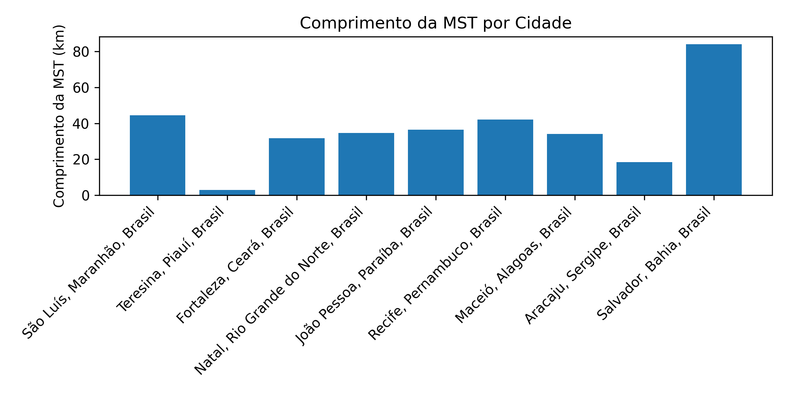
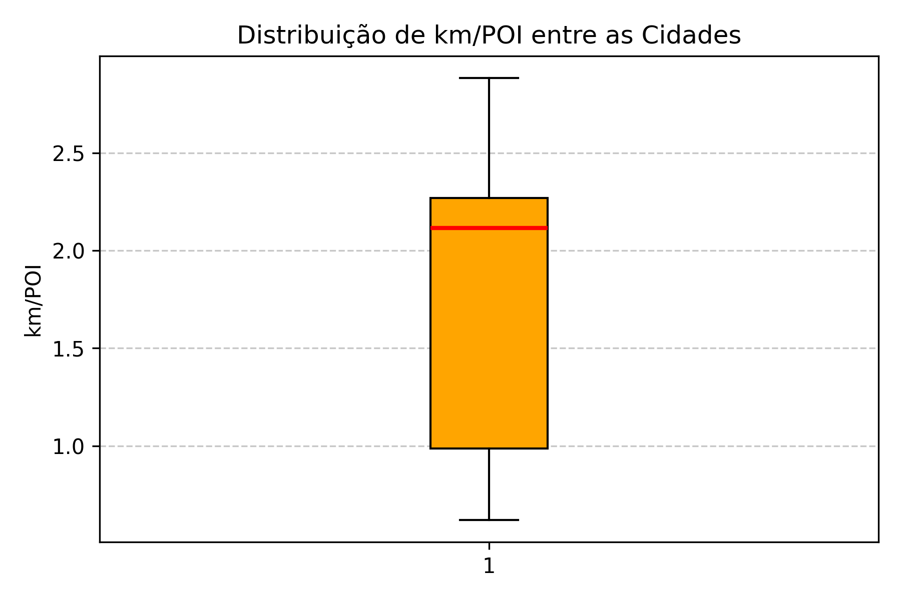
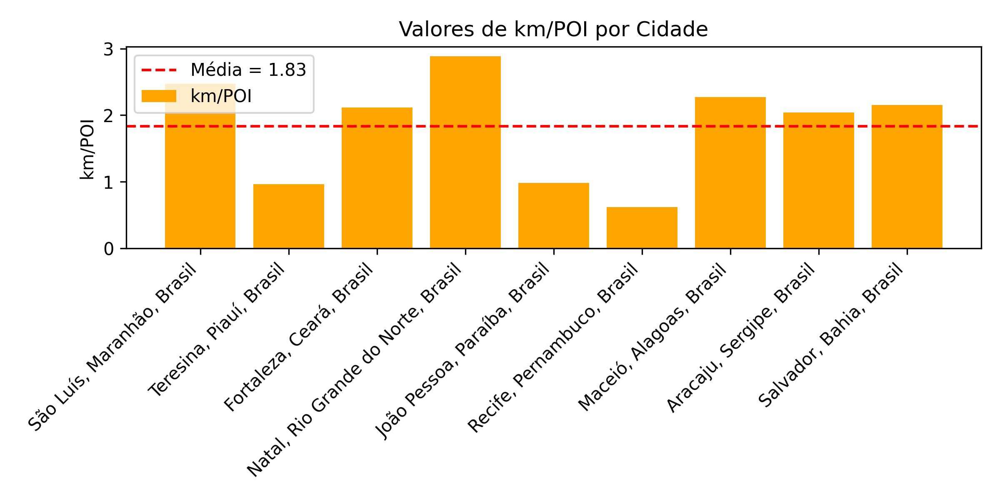
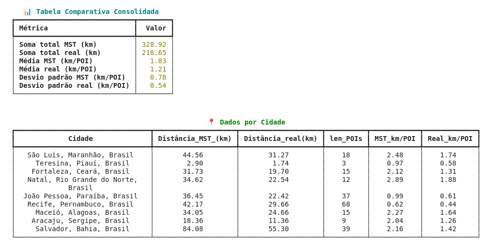

# 🧭 Rotas Turísticas nas Capitais do Nordeste Brasileiro com OSMnx, A* e MST

## 🎯 Objetivo
Este projeto tem como objetivo **analisar a conectividade entre atrações turísticas** nas **capitais do Nordeste do Brasil**, utilizando dados do **OpenStreetMap (OSM)**.  
A análise consiste em:
- Construir o grafo viário de cada cidade.  
- Identificar os pontos turísticos (POIs).  
- Calcular as **rotas mínimas** entre eles com o algoritmo **A\***.  
- Gerar uma **Árvore Geradora Mínima (MST)** para estimar a distância mínima necessária para interligar todas as atrações turísticas.

---

## 🏙️ Cidades analisadas
As nove capitais nordestinas incluídas no estudo:

| Nº | Cidade | Estado |
|:--:|:--------|:--------|
| 1 | São Luís | Maranhão |
| 2 | Teresina | Piauí |
| 3 | Fortaleza | Ceará |
| 4 | Natal | Rio Grande do Norte |
| 5 | João Pessoa | Paraíba |
| 6 | Recife | Pernambuco |
| 7 | Maceió | Alagoas |
| 8 | Aracaju | Sergipe |
| 9 | Salvador | Bahia |

---

## 🗺️ 1) Coleta dos POIs
Os **Pontos de Interesse (POIs)** foram obtidos diretamente do **OpenStreetMap**, com as seguintes tags:
```python
tags = {
    "tourism": ["attraction", "viewpoint"]
}
```

A extração foi realizada com a função abaixo, que retorna os pontos turísticos e o número total de POIs encontrados em cada cidade:

```python
def pois_city(place,tags):
    pois = ox.features.features_from_place(place, tags=tags)

    # Extrair pontos representativos (centroides se for polígono)
    pois_points = []
    for idx, row in pois.iterrows():
        if row.geometry.geom_type == 'Point':
            pois_points.append((row.geometry.y, row.geometry.x))
        else:
            pois_points.append((row.geometry.centroid.y, row.geometry.centroid.x))
    return pois_points, len(pois_points)
    

```
Essa função coleta as feições do OpenStreetMap de acordo com as tags definidas e converte suas geometrias em coordenadas de ponto (latitude e longitude), utilizando o centróide no caso de polígonos.
Assim, ela garante uma representação uniforme dos POIs, independentemente do tipo de geometria original.

As categorias consideradas incluem pontos turísticos, mirantes, monumentos e locais históricos.
Cada POI obtido foi posteriormente associado ao nó viário mais próximo no grafo da cidade.

## 🚗 2) Grafo Viário

O grafo viário de cada cidade foi obtido a partir do **OpenStreetMap** usando o **OSMnx**, restrito ao tipo de rede `"drive"`, que inclui apenas vias acessíveis por veículos.  

Para garantir a consistência na análise de distâncias e rotas, o grafo foi convertido de um formato **direcionado (`MultiDiGraph`)** para um formato **não-direcionado (`MultiGraph`)**, preservando todos os atributos das arestas e nós.  
Essa conversão é necessária porque a análise de conectividade e o cálculo das rotas mínimas entre pontos turísticos **não dependem da direção do tráfego**, mas apenas da distância física entre os pontos.

O processo foi implementado pelas funções abaixo:

```python
def to_undirected_multigraph(G):
    """
    Converte um MultiDiGraph direcionado em um MultiGraph não-direcionado,
    preservando atributos dos nós e arestas.
    """
    H = nx.MultiGraph()
    # Copiar nós e seus atributos
    for n, data in G.nodes(data=True):
        H.add_node(n, **data)

    # Copiar arestas e seus atributos, sem direcionamento
    for u, v, data in G.edges(data=True):
        # Em um MultiGraph, se já existir uma aresta u-v, esta será adicionada como mais uma aresta paralela
        H.add_edge(u, v, **data)

    # Copiar atributos do grafo
    H.graph.update(G.graph)
    return H


def road_graph(place):
    """
    Cria o grafo viário de uma cidade a partir do OpenStreetMap e
    o converte para um MultiGraph não-direcionado.
    """
    G = ox.graph_from_place(place, network_type='drive')

    # Converte para não-direcionado mantendo o tipo MultiGraph
    G_undirected = to_undirected_multigraph(G)

    return G_undirected


def search_nodes(POIs, G_undirected):
    # ============================================
    # 3. Encontrar nós mais próximos dos POIs
    # ============================================
    latitudes = [hp[0] for hp in POIs]
    longitudes = [hp[1] for hp in POIs]
    pois_nodes = ox.distance.nearest_nodes(G_undirected, X=longitudes, Y=latitudes)
    #pois_nodes = list(set(pois_points))
    
    if len(pois_nodes) < 2:
        raise ValueError("POIs insuficientes para criar um MST (menos de 2 pontos).")

    return pois_nodes
        

```
### A função road_graph() é responsável por:

 - Baixar o grafo viário da cidade especificada (place) com OSMnx.

 - Converter o grafo para não-direcionado, facilitando o cálculo das rotas e da árvore geradora mínima (MST).

 - Retornar o grafo processado, pronto para associar os POIs e calcular as rotas A*.

O resultado é um grafo que representa a infraestrutura viária real da cidade, com distâncias físicas preservadas e pronto para as próximas etapas da análise.

### A função search_nodes(POIs, G_undirected) é responsável por:

 - Detectar os nós mais proximos do grafo em relação aos POIs.
 - Retorna os nós do grafos proximos aos POIs

## 🧮 3) Rotas Mais Curtas com A\*

Após identificar os nós correspondentes aos **POIs**, foi calculada a **rota mais curta** entre cada par de pontos usando o algoritmo **A\***, que combina custo acumulado e heurística euclidiana (distância em linha reta).

```python
def build_complete_graph_with_astar(G_undirected,POIs_nodes):

    
    G_interest = nx.Graph()
    
    for i in range(len(pois_nodes)):
        for j in range(i + 1, len(pois_nodes)):
            try:
                # Rota ótima via A*
                route = nx.astar_path(
                    G_undirected,
                    pois_nodes[i],
                    pois_nodes[j],
                    heuristic=lambda u, v: ox.distance.euclidean(
                        G_undirected.nodes[u]['y'], G_undirected.nodes[u]['x'],
                        G_undirected.nodes[v]['y'], G_undirected.nodes[v]['x']
                    ),
                    weight='length'
                )
    
                # Comprimento total da rota
                route_length = sum(
                    G_undirected[route[k]][route[k + 1]][0]['length']
                    for k in range(len(route) - 1)
                )
    
                # Armazena a rota e o comprimento
                G_interest.add_edge(
                    pois_nodes[i],
                    pois_nodes[j],
                    weight=route_length,
                    path=route
                )
    
            except nx.NetworkXNoPath:
                continue
    
    print(f"Grafo de interesse criado com {G_interest.number_of_edges()} arestas.")

    return route,route_length,G_interest
```

Essa função cria um grafo completo dos POIs, onde o peso de cada aresta é a distância real entre eles na malha viária.
O resultado é usado na etapa seguinte para gerar a Árvore Geradora Mínima (MST).

## 🧩 4) MST sobre o grafo completo de POIs

A função `cal_mst` calcula a **árvore geradora mínima (MST)** entre os POIs, usando as **distâncias A\*** como pesos.  
Ela retorna o conjunto de arestas da MST e o comprimento total necessário para conectar todos os POIs, tanto no grafo teórico quanto na **malha viária real**.

```python
def cal_mst(G_interest, G_undirected):
    # Calcular MST (Kruskal)
    mst_edges = list(nx.minimum_spanning_edges(G_interest, data=True))
    total_mst_length = sum([d['weight'] for (_, _, d) in mst_edges])
    print(f"📏 Comprimento total do MST: {total_mst_length/1000:.2f} km")

    # União das rotas correspondentes na malha viária
    edges_in_mst_routes = set()
    for u, v, data in mst_edges:
        path = data['path']
        for i in range(len(path) - 1):
            edge = tuple(sorted((path[i], path[i + 1])))
            edges_in_mst_routes.add(edge)

    # Somar o comprimento total real da rede resultante
    total_real_length = sum(
        G_undirected[u][v][0]['length'] for u, v in edges_in_mst_routes
        if G_undirected.has_edge(u, v)
    )

    print(f"🌐 Comprimento total real da rede: {total_real_length/1000:.2f} km")

    return mst_edges, total_mst_length, total_real_length

```

| Métrica                               | Significado                                                          | Como é calculada                                                             |
| ------------------------------------- | -------------------------------------------------------------------- | ---------------------------------------------------------------------------- |
| **📏 Comprimento total da MST**       | Distância **teórica mínima** necessária para conectar todos os POIs. | Soma das **distâncias A*** entre POIs (no grafo completo).                   |
| **🌐 Comprimento total real da rede** | Extensão **real das ruas** usadas pelas conexões da MST.             | Soma dos **comprimentos reais das vias** (sem duplicar ruas compartilhadas). |

## 5) Comparação entre ≥ 8 cidades

A análise comparativa entre as cidades permite identificar diferenças significativas na conectividade e extensão mínima das redes que ligam os POIs (pontos de interesse). As métricas foram obtidas a partir do comprimento total da MST (Minimum Spanning Tree), normalizadas também em km/POI para refletir a eficiência de conexão relativa a cada cidade.

### 📊 Comprimento da MST por cidade


O gráfico acima mostra o comprimento total da MST em quilômetros para cada cidade. Observa-se que **Salvador** e **São Luís** possuem os maiores valores, refletindo áreas urbanas mais extensas e distribuição mais dispersa dos POIs. Em contraste, **Teresina** e **Aracaju** apresentam valores menores, indicando malhas urbanas mais concentradas e conectividade mais compacta.

---

### 📦 Distribuição de km/POI


O boxplot ilustra a variação de **km/POI** entre as cidades. A dispersão é moderada, sugerindo que a relação entre extensão da rede e número de pontos tende a ser consistente, mas com exceções em cidades de grande porte. Valores mais altos de km/POI podem indicar POIs periféricos ou lacunas de conectividade na malha viária.

---

### 🏙️ km/POI por cidade


No gráfico acima, observa-se a proporção **km/POI** de cada cidade, com a linha vermelha representando a média geral. Cidades como **Maceió** e **Recife** mantêm valores próximos à média, indicando equilíbrio entre quantidade de POIs e extensão viária necessária. Já **Salvador** e **São Luís** destacam-se acima da média, o que reforça o padrão de dispersão urbana.

### Tabela de métricas



---

### 🧩 Interpretação geral

Em síntese, as diferenças entre cidades refletem tanto fatores **geográficos e urbanísticos** quanto a **seleção dos POIs**. Cidades maiores e mais heterogêneas exigem mais quilômetros para conectar seus pontos, enquanto centros urbanos compactos apresentam redes mais eficientes.  
A MST fornece uma estimativa do **“esqueleto viário mínimo”**, útil para comparar padrões de conectividade urbana, mas não considera fluxos de tráfego, declividades ou capacidade das vias.  
Além disso, a biblioteca **OSMnx** apresenta limitações pontuais — podendo **não capturar todos os POIs** relevantes devido à categorização inconsistente ou ausência de registros no OpenStreetMap.

---


## 🧩 Análise Crítica

A variação no comprimento total das MSTs entre as cidades está diretamente relacionada à distribuição espacial e quantidade de POIs. Cidades mais extensas ou com pontos de interesse mais dispersos — como Salvador e São Luís — tendem a exigir maiores comprimentos de rede para conectá-los, refletindo maior área urbana e complexidade viária. Em contrapartida, cidades menores ou com POIs concentrados — como Teresina e Aracaju — apresentam MSTs mais curtas, indicando uma estrutura urbana mais densa e conectada.

A escolha e localização dos POIs influenciam fortemente o resultado. Quando os POIs estão restritos a regiões centrais ou turísticas, a MST tende a ser mais compacta; já a inclusão de pontos periféricos aumenta consideravelmente o comprimento total. Além disso, a densidade e conectividade da malha viária local interferem na eficiência das rotas A*, pois vias mais interligadas reduzem as distâncias entre POIs.

Entre as limitações do método, destaca-se a suposição de que o conjunto de POIs representa adequadamente a estrutura urbana, o que pode não ocorrer em cidades com grande heterogeneidade espacial. A MST também ignora fluxos de tráfego, capacidade viária e restrições topográficas, considerando apenas a distância mínima. Soma-se a isso o fato de que a biblioteca OSMnx, utilizada para obter a malha viária e os pontos de interesse, nem sempre captura todos os POIs relevantes, seja por limitações da base do OpenStreetMap ou por inconsistências de categorização.

Assim, embora a MST forneça uma boa aproximação do “esqueleto viário mínimo” de uma cidade, ela não representa integralmente a complexidade e as particularidades reais da infraestrutura urbana.