# 📚 Projeto Biblioteca – Análises de Empréstimos

**Fonte dos Dados:** Os dados utilizados neste projeto foram retirados dos **Dados Abertos da UFRN**: [https://dados.ufrn.br](https://dados.ufrn.br)

👤 **Autor:**  
Nome: Carlos Eduardo Medeiros da Silva  
Matrícula: 20250070673

---

## 🔎 Visão Geral
Este projeto tem como objetivo **analisar os padrões de empréstimos em uma biblioteca universitária - SEMESTRE 2022.2** utilizando **modelagem em grafos**.  
A análise busca identificar:
- Usuários mais ativos
- Livros mais populares
- Assuntos de maior interesse
- Clusters de usuários com interesses comuns

---

## 🛠️ 1. Preparação dos Dados

A preparação dos dados foi realizada nos notebooks **`database_create.ipynb`** e **`categoryTofill.ipynb`**, seguindo as etapas abaixo:

- **Coleta e Limpeza**  
  Carregamento dos datasets de empréstimos e exemplares, seguido por um processo de limpeza e tratamento para garantir a consistência e a qualidade das informações.  

- **Enriquecimento dos Dados**  
  Cruzamento das informações de empréstimos com os dados do acervo para obter detalhes sobre os livros, como título e assunto.  

- **Categorização de Assuntos**  
  Utilização de técnicas de Processamento para agrupar assuntos similares em categorias mais amplas, facilitando a análise de padrões de interesse.  

- **Dataset Final**  
  O resultado desta etapa é o arquivo **`dataset_FINAL_COMPLETO.csv`**, que serve como base para a criação e análise dos grafos.  

### Estrutura do Dataset Final

O dataset final contém as seguintes colunas:

| Coluna                | Descrição                                                                 |
|------------------------|---------------------------------------------------------------------------|
| `codigo_barras`        | Identificador único do exemplar físico do acervo (cada cópia tem um código diferente). |
| `nome_usuario`         | Nome da pessoa que realizou o empréstimo.                                |
| `tipo_vinculo_usuario` | Categoria do usuário (ex.: aluno, professor, técnico-administrativo).     |
| `matricula_ou_siape`   | Identificação única do usuário (matrícula para alunos ou SIAPE para servidores). |
| `registro_sistema`     | Identificador do item dentro do sistema da biblioteca (ID único do título). |
| `assunto`              | Tema principal associado ao livro no acervo (informação catalogada).      |
| `categoria`            | Agrupamento de assuntos em categorias mais gerais, obtidas pelo processamento dos dados. |
| `tipo_material`        | Tipo do item (ex.: livro, periódico, TCC, dissertação, tese).             |
| `titulo_completo`      | Nome completo da obra, incluindo subtítulo e outras informações relevantes. |

---

## 🛠️ 2. Metodologia

### Transformação em Grafos
- **Grafo bipartido Usuário ↔ Livro**  
  Conexões entre usuários e os livros que pegaram emprestados.  
  Pesos: número de empréstimos.

- **Grafo bipartido Usuário ↔ Assunto**  
  Conexões entre usuários e os assuntos dos livros emprestados.  
  Pesos: quantidade de livros do mesmo assunto.

- **Grafos projetados**  
  Usuário ↔ Usuário: usuários que compartilham interesses.

## 📈 Métricas de Rede Utilizadas

As métricas calculadas para os grafos incluem:

| Métrica                                   | Descrição                                                                 | Função NetworkX |
|-------------------------------------------|---------------------------------------------------------------------------|----------------|
| **Número de nós**                         | Quantidade de vértices na rede (usuários, livros ou assuntos).           | `G.number_of_nodes()` |
| **Número de arestas**                      | Quantidade de conexões entre os nós.                                     | `G.number_of_edges()` |
| **Grau dos nós**                           | Número de conexões de cada nó.                                           | `dict(G.degree())` |
| **Grau médio da rede**                      | Média do grau de todos os nós.                                           | `sum(dict(G.degree()).values()) / G.number_of_nodes()` |
| **Densidade da rede**                       | Razão entre o número de arestas existentes e o número máximo possível.   | `nx.density(G)` |
| **Distribuição de graus**                  | Frequência de ocorrência dos graus dos nós (histograma).                  | `list(dict(G.degree()).values())` |
| **Assortatividade da rede**                | Tendência de nós com graus semelhantes se conectarem entre si.           | `nx.degree_assortativity_coefficient(G)` |


### Visualizações
- Grafos interativos (usuário ↔ livro, usuário ↔ assunto)  
- Histogramas dos **top usuários, livros e assuntos**  
- Redes projetadas mostrando clusters de interesse  

---

## 📊 Resultados

### 🔹 Grafo Usuário ↔ Livro
*(Grafo amostral de Usuário - livros)*  
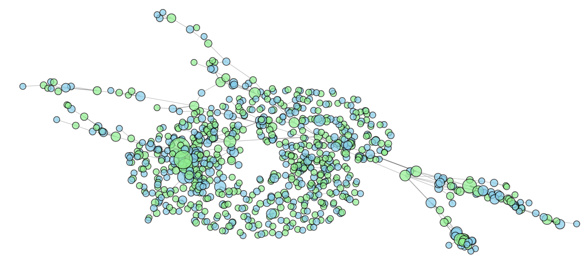

*(Metricas do Grafo Usuário-Livro)*  
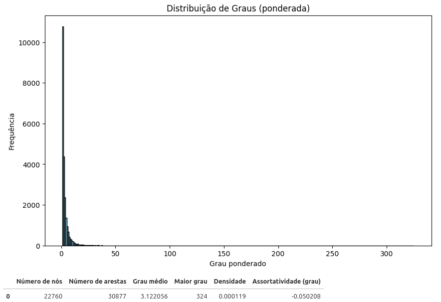


#### 🔹 Top Usuários por Empréstimos
*(Emprestimos por tipo de vinculo)*  
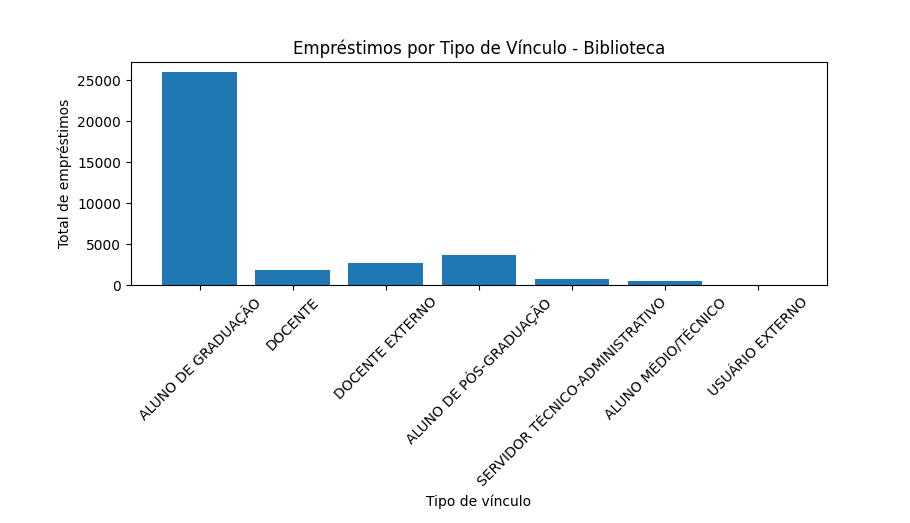

*(User mais ativo: 20170021397)*
*(Grafo do User mais ativo)*
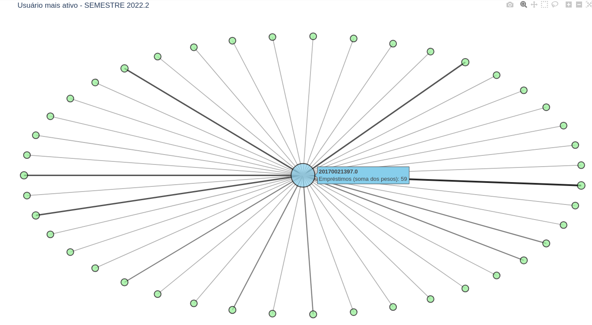

#### 🔹 Top Livros por Popularidade
*(TOP 10 - Livros)*  
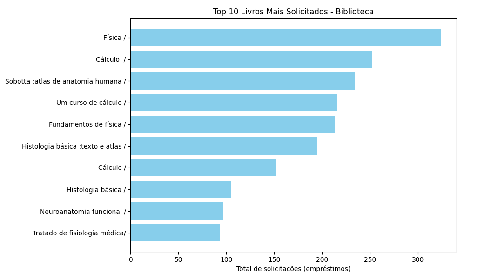


### 🔹 Grafo Usuário ↔ Categoria (Assunto)
*(Grafo amostral de Usuário - Categoria)*  
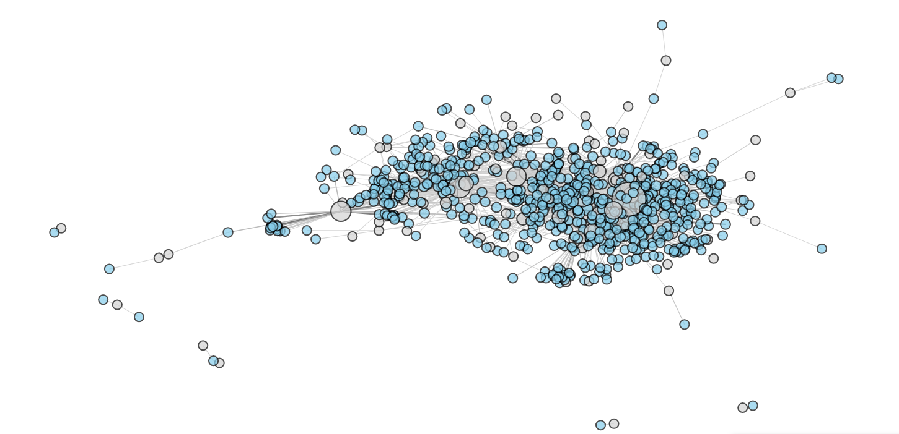

*(Metricas do Grafo Usuário - Categoria)*  
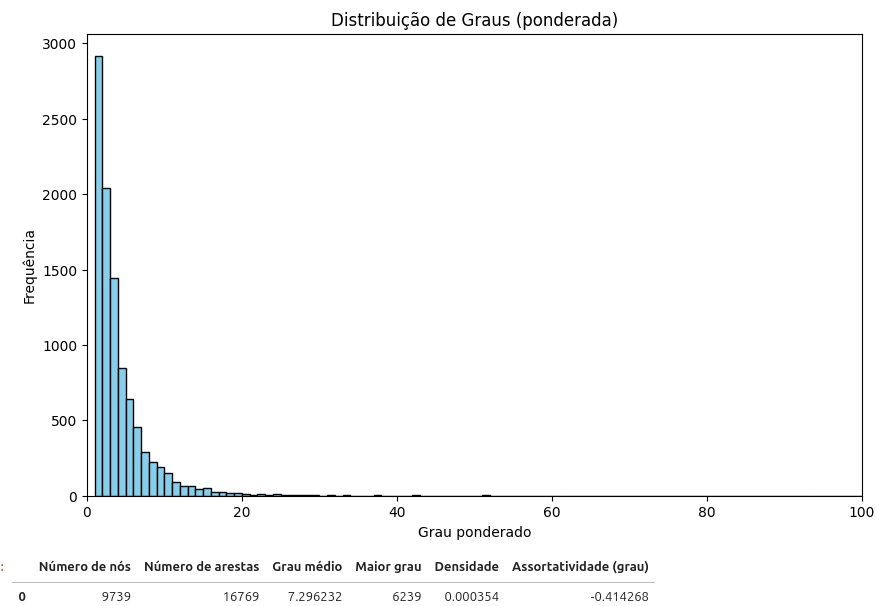


### 🔹 Grafo Usuário ↔ Usuário: Relações
*(Grafo amostral de Usuário - Usuario)*  
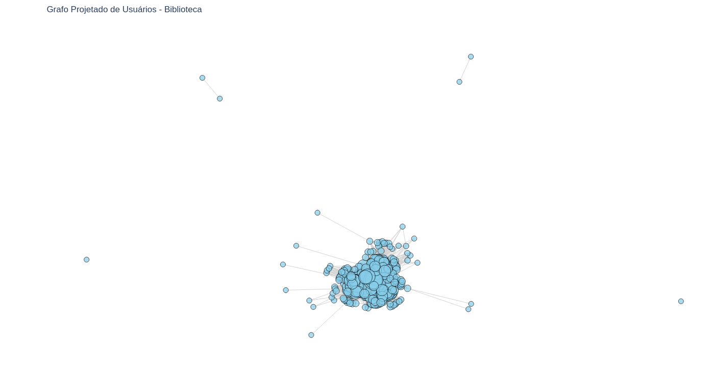

*(Metricas do Grafo Usuário - Categoria)*  
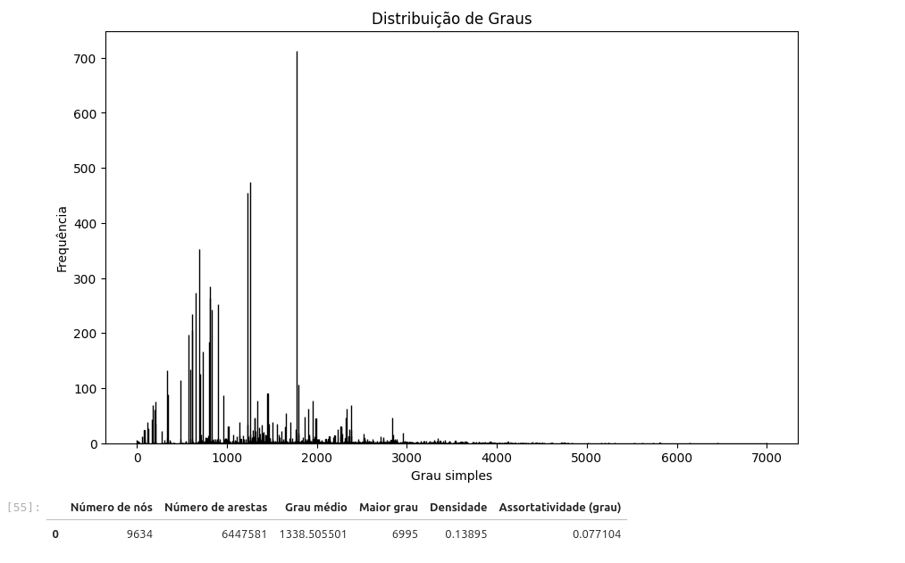

### 🔹 Grafo Usuário ↔ Usuário: Clusters de Interesse

Com o grafo projetado **Usuário → Usuário**, podemos identificar **grupos de usuários com interesses em comum**.  

```python
import networkx as nx
from networkx.algorithms import community

comunidades = community.louvain_communities(G_usuarios, seed=42)

# Filtrar apenas comunidades com mais de 10 usuários
comunidades = [c for c in comunidades if len(c) > 10]

```

###  🔹Comunidades

*(Comunidade 1)*  
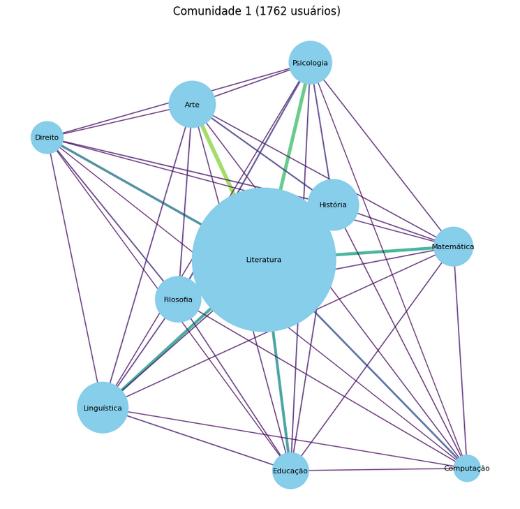

*(Comunidade 2)*  
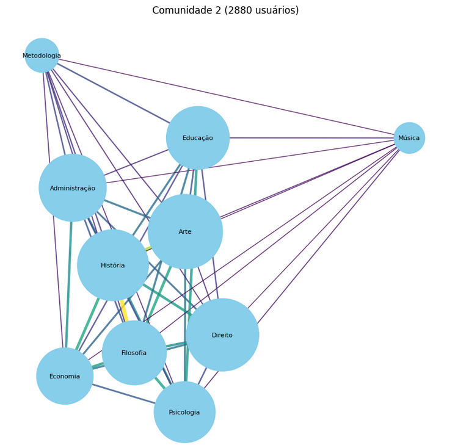

*(Comunidade 3)*  
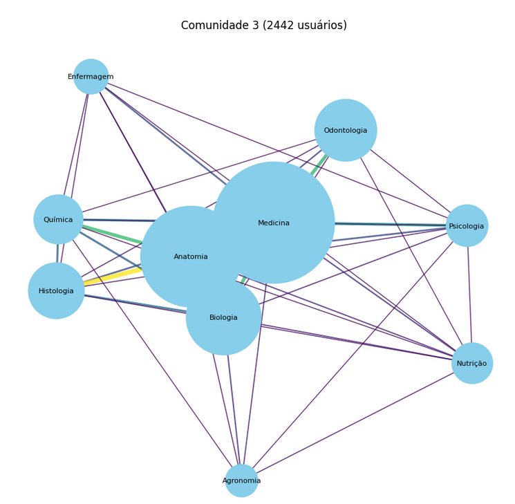

*(Comunidade 4 )*  
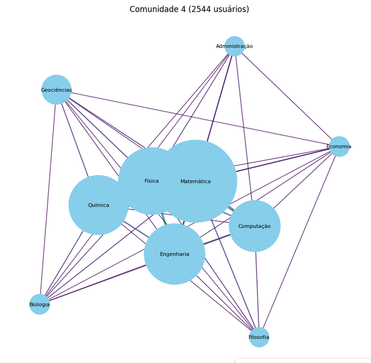


---

## 🛠️ Principais Bibliotecas e Ferramentas

O projeto utilizou diversas bibliotecas do ecossistema Python para **processamento de dados, modelagem de grafos, NLP e aprendizado de máquina**. As principais incluem:

### 📊 Manipulação e Análise de Dados
- **[Pandas](https://pandas.pydata.org/)** – Tratamento e limpeza do dataset, remoção de valores ausentes e classes raras.  
- **[NumPy](https://numpy.org/)** – Operações numéricas e suporte a arrays.  

### 🕸️ Grafos e Redes
- **[NetworkX](https://networkx.org/)** – Criação de grafos bipartidos, projeção de usuários e análise de métricas de rede.  
- **[Community / Louvain](https://python-louvain.readthedocs.io/)** – Detecção de comunidades de interesse entre usuários.  

### 📈 Visualização
- **[Matplotlib](https://matplotlib.org/)** / **Seaborn** – Histogramas e métricas de grau.  
- **[Plotly](https://plotly.com/python/)** – Grafos interativos e visualização dinâmica de clusters.

### 🤖 Processamento de Linguagem Natural e Modelos
- **[Transformers](https://huggingface.co/docs/transformers/index)** – Treinamento de modelo BERT em português para classificação de assuntos, para ajudar na criação da base de dados.  
- **[Datasets](https://huggingface.co/docs/datasets/index)** – Criação de datasets compatíveis com Hugging Face.  
- **[Scikit-learn](https://scikit-learn.org/)** – Divisão de treino/teste e métricas (accuracy, F1).  

### 💡 Ferramenta de Apoio
- **ChatGPT** – Auxílio na criação de scripts, limpeza de dados, organização do pipeline e elaboração deste README.

---

> Essas ferramentas permitiram **estruturar a base de dados**, **modelar os grafos de usuários e livros**, **detectar clusters de interesse** e **treinar o modelo de classificação de assuntos** de forma eficiente.
