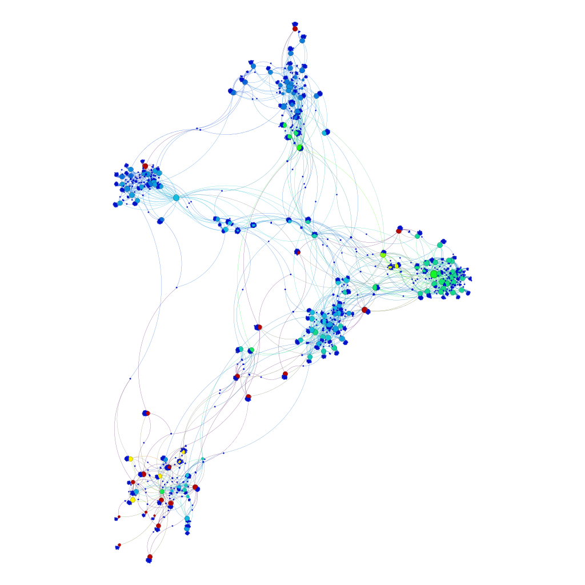
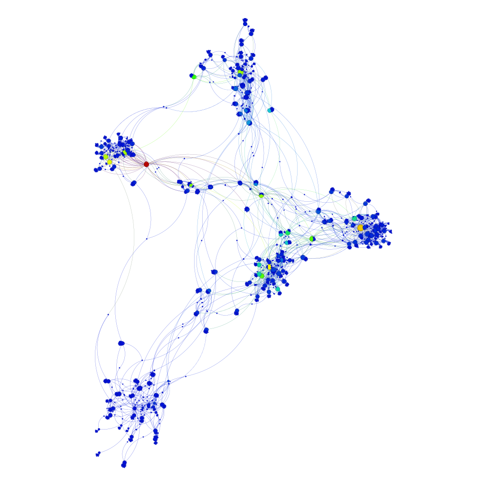
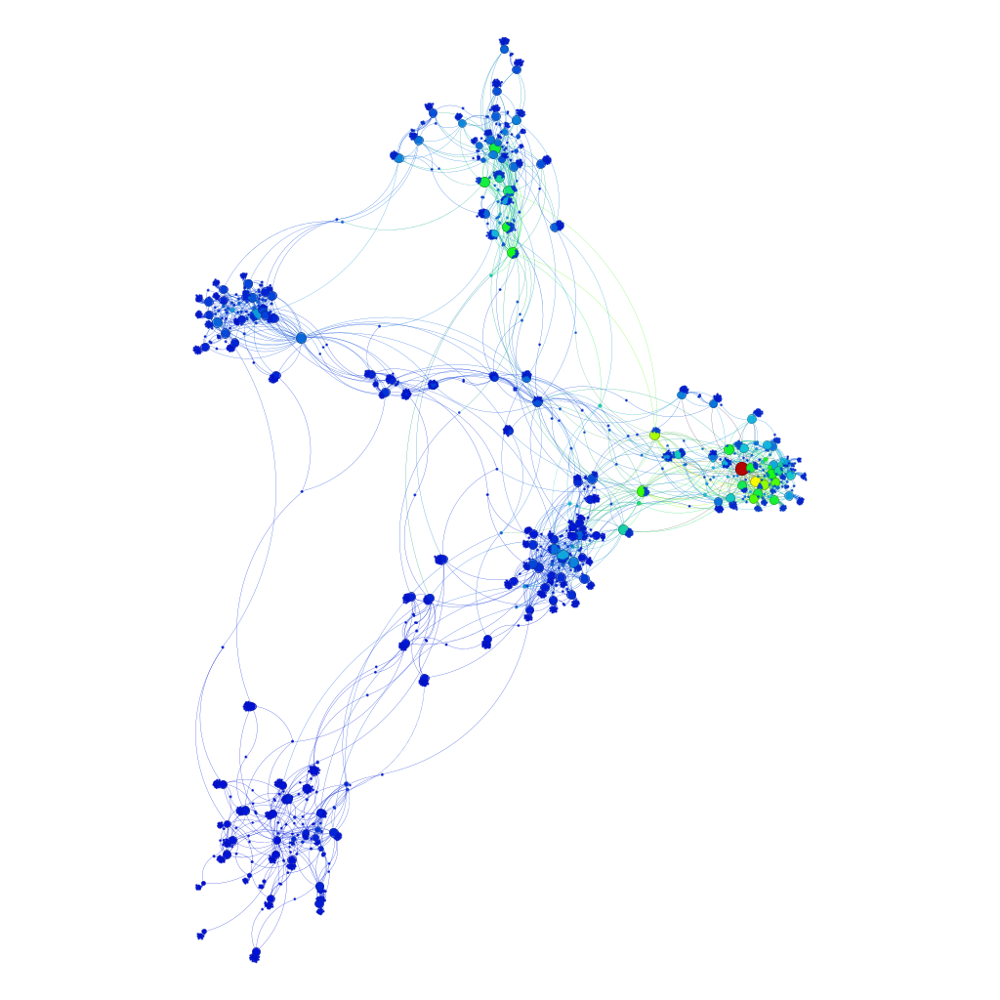
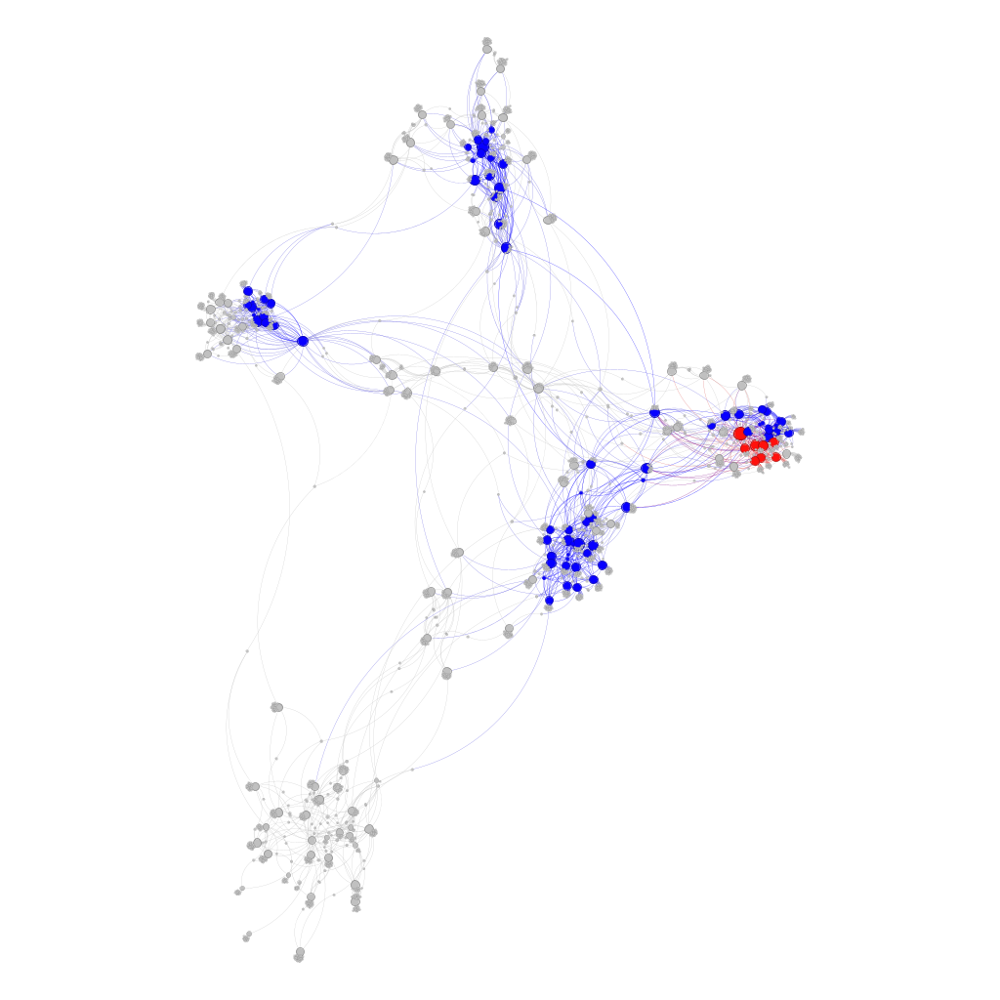

# Grafos, Estruturas Complexas e Métricas de Avaliação


👤 Autor:
Nome: Carlos Eduardo Medeiros da Silva
Matrícula: 20250070673

🎬 **Vídeo do YouTube:** [Assista aqui](https://youtu.be/rThyMfwVY7k)


```sh
Notebook-base I: notebooks/Hubs.ipnyb
Notebook-base II: notebooks/Wikipedia.ipynb
```

# 🎯 Objetivo do Projeto

O objetivo deste projeto é analisar uma rede de estruturas complexas construída a partir de páginas da Wikipedia, aplicando os conhecimentos vistos nas Semanas 10 e 11 do curso, com foco em:

- Construção automática de grafos a partir de páginas da Wikipedia

- Exploração de links utilizando busca em largura (BFS)

- Aplicação de métricas de centralidade

- Análise estrutural da rede no Gephi

- Uso de técnicas de otimização para compreender a dinâmica do grafo

A rede foi construída a partir da mesclagem de 5 SEEDs pertencentes a temas diferentes, garantindo diversidade estrutural.
Os SEEDs utilizados foram:

```python
SEEDS = [
    "Cristiano Ronaldo",
    "Mount Everest",
    "Python (programming language)",
    "French Revolution",
    "Albert Einstein"
]
```


Para cada SEED, foi executado um algoritmo de exploração de links baseado em BFS até o nível 2 (altura < 3).
Em sala de aula, o exemplo foi feito apenas até altura < 2, portanto este trabalho amplia o escopo, permitindo capturar uma estrutura de rede mais rica e abrangente.

## 🏗️ Construção do Grafo e Estratégias Escolhidas

```python
import wikipedia
import networkx as nx
from collections import deque

# ==========================
# CONFIGURAÇÕES
# ==========================

SEEDS = [
    "Cristiano Ronaldo",
    "Mount Everest", 
    "Python (programming language)",
    "French Revolution",
    "Albert Einstein"
]

MAX_DEPTH = 2
MAX_LINKS_PER_PAGE = 30  # Pega os top 15 links mais relevantes
MIN_CONTENT_LENGTH = 500 # Ignora páginas muito curtas (stubs)

# Palavras/Prefixos para ignorar
STOPS = {
    "Portal:", "Category:", "Help:", "Draft:", "Template:", 
    "Module:", "File:", "Image:", "Wikipedia:", "Talk:", 
    "User:", "MediaWiki:", "Special:", "Bibcode", "Doi", "Isbn", "Issn"
}

# Palavras genéricas para filtrar títulos
GENERAL_WORDS = {
    "history", "geography", "culture", "economy",
    "politics", "science", "sport", "language",
    "country", "region", "list", "outline", "bibliography",
    "timeline", "glossary", "index"
}

g = nx.DiGraph()
edges_temp = [] 

# ==========================
# HEURÍSTICA 
# ==========================

def get_best_links_fast(page_obj, max_links):
    """
    Analisa os links presentes na página e pontua baseando-se
    no conteúdo JÁ BAIXADO (frequência no texto e posição).
    """
    scored_links = []
    
    # Prepara textos para busca rápida (cache local)
    try:
        content_lower = page_obj.content.lower()
        summary_lower = page_obj.summary.lower()
        title_parts = set(page_obj.title.lower().split())
    except:
        return []

    for link in page_obj.links:
        link_lower = link.lower()
        
        # --- FILTROS ---
        # 1. Namespaces administrativos
        if any(link.startswith(s) for s in STOPS):
            continue
            
        # 2. Listas e Genéricos
        if link_lower.startswith("list of"):
            continue
        if any(w in link_lower for w in GENERAL_WORDS):
            continue
            
        # 3. Anos ou Números isolados (ex: "2023", "1990")
        if link.isdigit(): 
            continue

        # --- PONTUAÇÃO ---
        score = 0
        
        # A: Frequência no texto principal (Relevância bruta)
        # Limitamos a contagem a 50 para evitar distorções em textos gigantes
        count = content_lower.count(link_lower)
        score += min(count, 50)
        
        # B: Está no Resumo? (Alta relevância conceitual)
        if link_lower in summary_lower:
            score += 20
            
        # C: Compartilha palavras com o título da página pai? (Contexto)
        link_parts = set(link_lower.split())
        if not title_parts.isdisjoint(link_parts):
            score += 10
            
        # Penalidade: Links muito longos (geralmente frases ou lixo)
        if len(link_parts) > 5:
            score -= 10

        # Só adiciona se tiver pontuação positiva
        if score > 0:
            scored_links.append((score, link))

    # Ordena decrescente pelo score
    scored_links.sort(reverse=True)
    
    # Retorna apenas os nomes dos top links
    return [link for _, link in scored_links[:max_links]]

# ==========================
# BFS (BUSCA EM LARGURA)
# ==========================

def explore_seed(start_page):
    queue = deque()
    queue.append((0, start_page))

    visited = set()
    failed = set()

    print(f"\n{'='*40}")
    print(f"SEED: {start_page}")
    print(f"{'='*40}")

    while queue:
        layer, page_title = queue.popleft()

        # Limite de profundidade
        if layer > MAX_DEPTH:
            continue

        # Evitar re-visitar no mesmo loop
        if page_title in visited:
            continue
        visited.add(page_title)

        prefix = "  " * layer
        print(f"{prefix}➤ [L{layer}] Acessando: {page_title}...", end=" ", flush=True)

        try:
            # O gargalo é AQUI. Fazemos apenas 1 request por nó.
            wiki_obj = wikipedia.page(page_title, auto_suggest=False)
            print("OK.")
        
        except wikipedia.exceptions.DisambiguationError as e:
            print("⚠ Desambiguação (Pulado)")
            # Opcional: pegar a primeira opção da desambiguação
            # if layer < MAX_DEPTH: queue.append((layer, e.options[0]))
            continue
        except wikipedia.exceptions.PageError:
            print("❌ Não encontrado")
            failed.add(page_title)
            continue
        except Exception as e:
            print(f"❌ Erro: {e}")
            failed.add(page_title)
            continue

        # Filtro de conteúdo mínimo
        if len(wiki_obj.content) < MIN_CONTENT_LENGTH:
            print(f"{prefix}   ↳ Ignorado (Texto muito curto)")
            continue

        # Se atingiu o limite de profundidade, não precisamos buscar links,
        # apenas adicionamos o nó ao grafo (processamento acima) e paramos.
        if layer == MAX_DEPTH:
            continue

        # --- APLICA A NOVA HEURÍSTICA ---
        # Passamos o objeto já baixado (wiki_obj)
        best_links = get_best_links_fast(wiki_obj, MAX_LINKS_PER_PAGE)

        for link in best_links:
            # Normalização simples
            link_clean = link.strip().replace("_", " ") # Títulos da wiki geralmente não têm _
            
            # Adiciona à lista de arestas
            edges_temp.append((page_title, link_clean))

            if link_clean not in visited and link_clean not in failed:
                queue.append((layer + 1, link_clean))

# ==========================
# EXECUÇÃO PRINCIPAL
# ==========================

for seed in SEEDS:
    explore_seed(seed)

# Construir grafo
g.add_edges_from(edges_temp)

print("\nProcessing Graph Cleanup...")

# 1. Remover Self-Loops
g.remove_edges_from(nx.selfloop_edges(g))

# 2. Unificar Plurais (Simples)
nodes_list = list(g.nodes())
mapping = {}
for node in nodes_list:
    plural = node + "s"
    if plural in g:
        mapping[plural] = node # Mapeia plural -> singular

if mapping:
    print(f"Unificando {len(mapping)} plurais...")
    g = nx.relabel_nodes(g, mapping) # Relabel é mais seguro que contract para strings

# 3. Unificar Case (Maiúscula/Minúscula)
# Wikipedia é Case Sensitive na primeira letra, mas vamos padronizar
mapping_case = {}
nodes_lower = {n.lower(): n for n in g.nodes()} # mapa lower -> original
for node in g.nodes():
    if node.lower() in nodes_lower and node != nodes_lower[node.lower()]:
        # Se existe versão alternativa, mapear para a que já existe
        mapping_case[node] = nodes_lower[node.lower()]

if mapping_case:
    g = nx.relabel_nodes(g, mapping_case)

# ==========================
# SALVAR E ESTATÍSTICAS
# ==========================

filename = "graph_wikipedia_opt.graphml"
nx.write_graphml(g, filename)

print(f"\n{'='*30}")
print(" RESULTADOS FINAIS")
print(f"{'='*30}")
print(f"Total de Nós:     {g.number_of_nodes()}")
print(f"Total de Arestas: {g.number_of_edges()}")
print(f"Arquivo Salvo:    {filename}")

# Bonus: Top 5 Centralidade de Grau (Quem recebeu mais links?)
try:
    in_degree = dict(g.in_degree())
    top_nodes = sorted(in_degree.items(), key=lambda x: x[1], reverse=True)[:5]
    print("\nTop 5 Páginas mais citadas no grafo:")
    for page, degree in top_nodes:
        print(f" - {page}: {degree} links recebidos")
except:
    pass

```

A construção de redes a partir de hiperlinks da Wikipedia apresenta um desafio clássico de **explosão combinatória**. Uma busca em largura (BFS) irrestrita até a profundidade 2 (Nível 0 $\to$ Nível 1 $\to$ Nível 2) resultaria em milhares de requisições, tornando o processo inviável computacionalmente.

Para cumprir o requisito de explorar a rede até **altura < 3** de forma eficiente, foi implementada uma arquitetura baseada em **Busca em Largura Limitada com Heurística de Relevância Local**.

### 🚀 1. Heurística de Otimização: "Zero-Request Scoring"

A principal estratégia adotada foi a criação de uma função de pontuação (`get_best_links_fast`) que seleciona os links mais promissores **sem realizar requisições HTTP adicionais**. A relevância de um link candidato é calculada analisando apenas o conteúdo da página pai já carregada na memória.

Os critérios de pontuação implementados foram:

* **Frequência no Texto (+):** Links que aparecem repetidamente no corpo do artigo recebem maior pontuação, indicando centralidade no tema.
* **Presença no Resumo (Summary) (++):** Links situados na introdução do artigo recebem um peso maior (+20 pontos), pois o *lead* da Wikipedia resume os conceitos mais vitais.
* **Similaridade de Contexto (+):** Se o texto do link compartilha palavras com o título da página atual, ele recebe bônus por coesão semântica.
* **Penalidade de Extensão (-):** Links com textos muito longos (geralmente frases inteiras ou ruído) sofrem penalidade.

Apenas os **top 30 links** (`MAX_LINKS_PER_PAGE`) com maior score são adicionados à fila de visitação, controlando o *branching factor* da rede.

### 🔍 2. Algoritmo de Exploração (BFS)

Utilizamos uma estrutura de fila (`deque`) para garantir a ordem de visitação em camadas:

1.  **Seeds:** O grafo inicia com 5 sementes de temas distintos (*Cristiano Ronaldo, Mount Everest, Python, French Revolution, Albert Einstein*).
2.  **Controle de Ciclos:** Um conjunto `visited` de acesso $O(1)$ impede que a busca entre em loops infinitos, comuns na estrutura da Wikipedia.
3.  **Filtros de Namespace:** Uma *stoplist* robusta ignora páginas administrativas sem valor semântico (ex: `User:`, `Talk:`, `Category:`, `Template:`).

### 🧹 3. Tratamento e Limpeza de Dados

Após a coleta, o grafo passa por uma etapa de refinamento para garantir a qualidade das métricas topológicas:

* **Remoção de Self-Loops:** Arestas de um nó para ele mesmo foram descartadas.
* **Unificação Semântica:** Algoritmos de pós-processamento unificam nós plurais e singulares (ex: "Algorithm" e "Algorithms") e padronizam a capitalização (Case Sensitivity), consolidando a estrutura da rede.

---

# 📊 Resultados e Análise Visual

Para a análise topológica, a rede construída foi exportada para o software **Gephi**. Abaixo apresentamos as visualizações geradas para atender aos requisitos de avaliação de centralidade e estrutura hierárquica.

---

## 📍 Requisito #01: Análise de Centralidades

Para estas visualizações, foram mantidas as seguintes configurações padrões para permitir comparabilidade:
* **Layout:** ForceAtlas 2 (para evidenciar a formação de clusters).
* **Tamanho dos Nós:** Proporcional ao **Grau (Degree)** (quanto mais conexões, maior o nó).
* **Escala de Cores:** Gradiente térmico (Azul = Baixo valor, Vermelho = Alto valor).

### 1. Centralidade de Proximidade (Closeness Centrality)

Esta métrica avalia a velocidade com que um nó consegue alcançar todos os outros nós da rede.



> **Análise:**
> Observamos que os nós com cores mais quentes (vermelhos/laranjas) estão situados no centro geométrico do grafo. Estes nós possuem a menor distância média para o restante da rede, indicando que são os pontos mais eficientes para a **disseminação rápida de informações**. Os nós periféricos (em azul) dependem de múltiplos saltos para acessar o lado oposto da rede.

### 2. Centralidade de Intermediação (Betweenness Centrality)

Esta métrica quantifica a frequência com que um nó atua como "ponte" no caminho mais curto entre dois outros nós.



> **Análise:**
> Diferente da proximidade, aqui destacam-se nós que funcionam como **pontos de controle ou gargalos (bottlenecks)**. É possível visualizar nós vermelhos que conectam clusters distintos (comunidades). A remoção destes nós críticos causaria a maior fragmentação possível na rede, isolando grupos de páginas inteiros.

### 3. Centralidade de Autovetor (Eigenvector Centrality)

Esta métrica mede a influência de um nó baseada na qualidade de suas conexões ("diga-me com quem andas e te direi quem és").



> **Análise:**
> As cores quentes concentram-se nos grupos mais densamente conectados. Um nó aqui torna-se vermelho não apenas por ter muitos vizinhos, mas por estar conectado a vizinhos que também são altamente conectados. Isso evidencia o **núcleo de influência e prestígio** da rede, onde a informação circula com maior intensidade.

---

## 🧅 Requisito #02: Estrutura K-Core e K-Shell

Esta visualização destaca a estrutura hierárquica da rede através da decomposição em camadas (*shells*) e núcleo (*core*).
* **Configuração:** Tamanho proporcional ao Grau (Degree).



> **Análise da Decomposição:**
> A imagem utiliza cores distintas para evidenciar a resiliência da rede:
>
> * 🔴 **Vermelho (K-Core Máximo):** Representa o núcleo mais denso da rede. Este subgrafo contém os nós que estão conectados a pelo menos *k* outros nós dentro do mesmo grupo. É a "espinha dorsal" da estrutura, sendo extremamente difícil de fragmentar.
> * 🔵 **Azul (K-Shell Intermediário):** Representa a camada periférica robusta. Estes nós possuem alta conectividade com o núcleo, servindo como zona de transição e proteção para o centro da rede.
> * ⚫ **Cinza:** Nós periféricos ou de baixa conectividade estrutural.
>
> A topologia sugere que a rede possui um centro de gravidade bem definido, onde a informação tende a ficar retida ou circular intensamente antes de se espalhar para as camadas externas.

## 🌐 Visualização Interativa (Deploy)

Para explorar a rede dinamicamente, navegar pelos nós e visualizar as conexões em detalhes, acesse a versão interativa do grafo no link abaixo:

🚀 **[Clique aqui para acessar o Grafo Online](https://carlos98770.github.io/dca3702-aed2/)**

